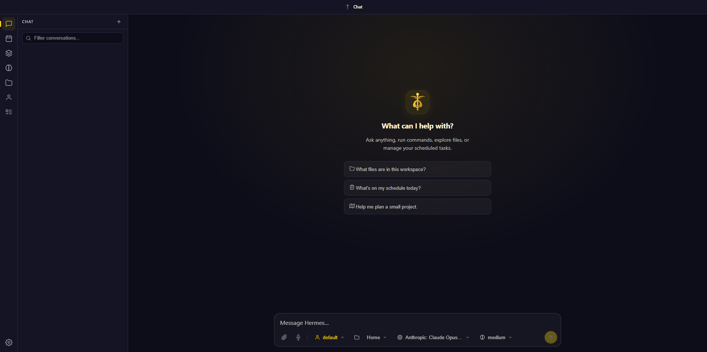

# Hermes WebUI CI/CD pipeline

Deploy Hermes WebUI server with CI/CD on Elestio

 
 

# Once deployed ...

You can open Hermes WebUI here:

    URL: https://[CI_CD_DOMAIN]
    password: [ADMIN_PASSWORD]

You can open the Hermes Agent monitoring dashboard here:

    URL: https://[CI_CD_DOMAIN]:9911
    login: root
    password: [ADMIN_PASSWORD]

# Configure your inference provider

After unlocking the WebUI with the password, run the interactive CLI once on the VM to pick a default provider and model. SSH into the VM, then:

    cd /opt/app/[CI_CD_FOLDER_NAME]
    docker-compose exec hermes-agent /opt/hermes/.venv/bin/hermes model

The wizard supports Nous Portal (free OAuth, no API key), OpenRouter, Anthropic, OpenAI, Gemini, GitHub Copilot, DeepSeek, Mistral, Kimi/Moonshot, Ollama, and others. After saving, restart the WebUI:

    docker-compose restart hermes-webui

API keys for individual providers can also be added or rotated from `Settings -> Providers` in the WebUI itself.
